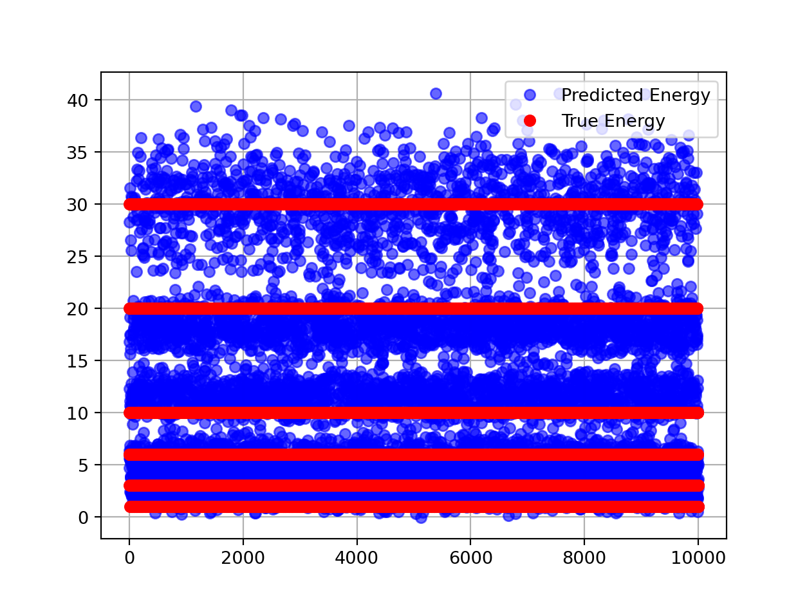
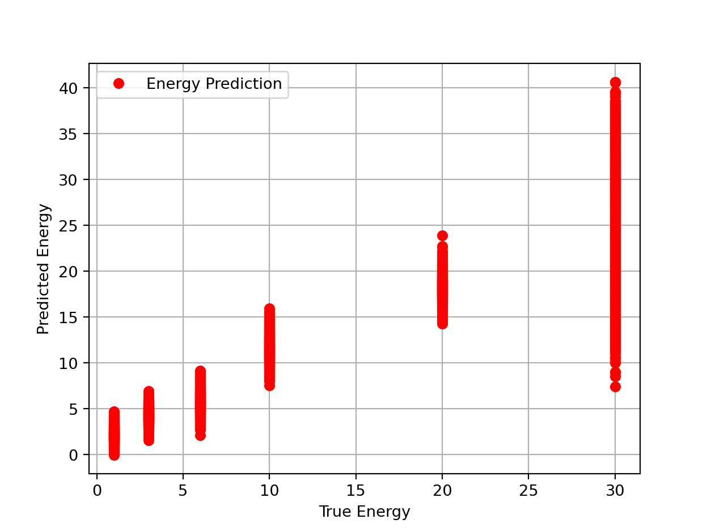
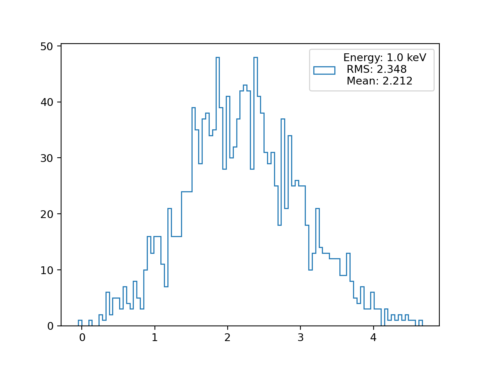
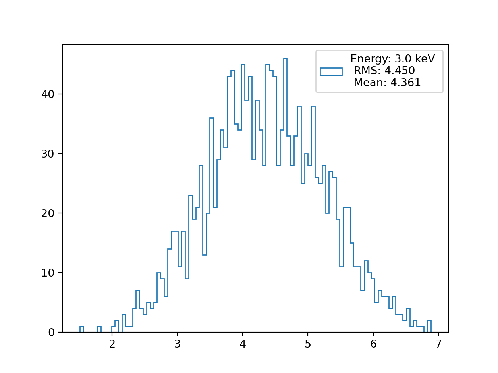
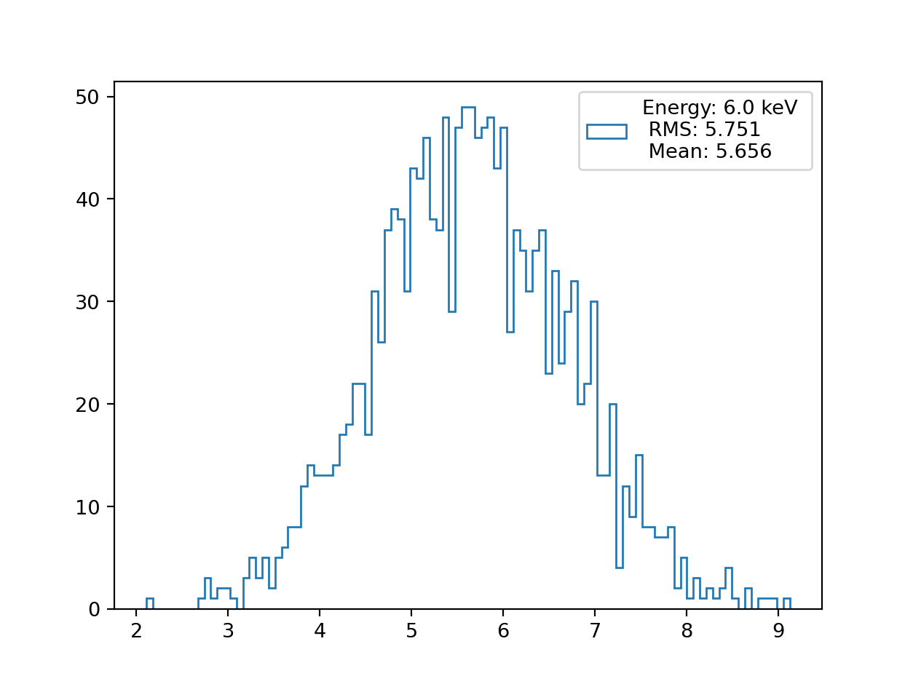
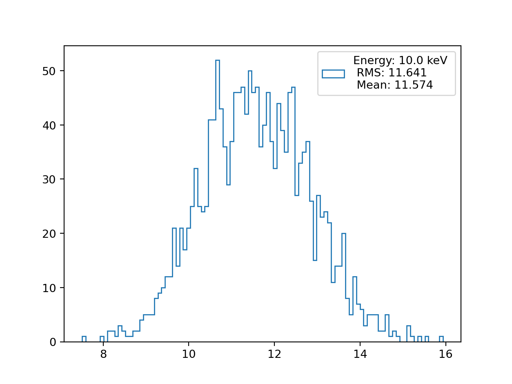
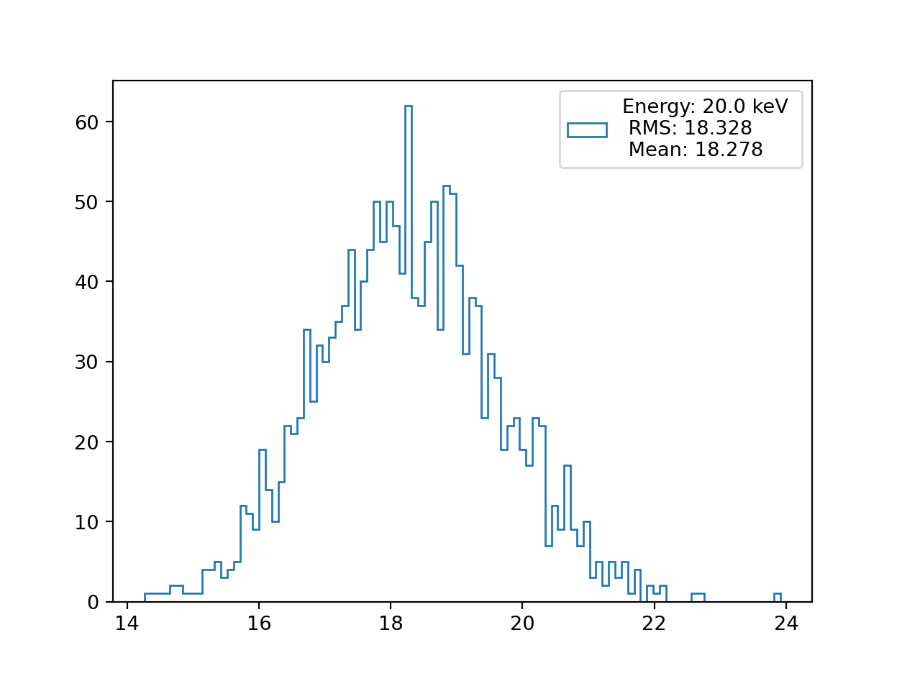
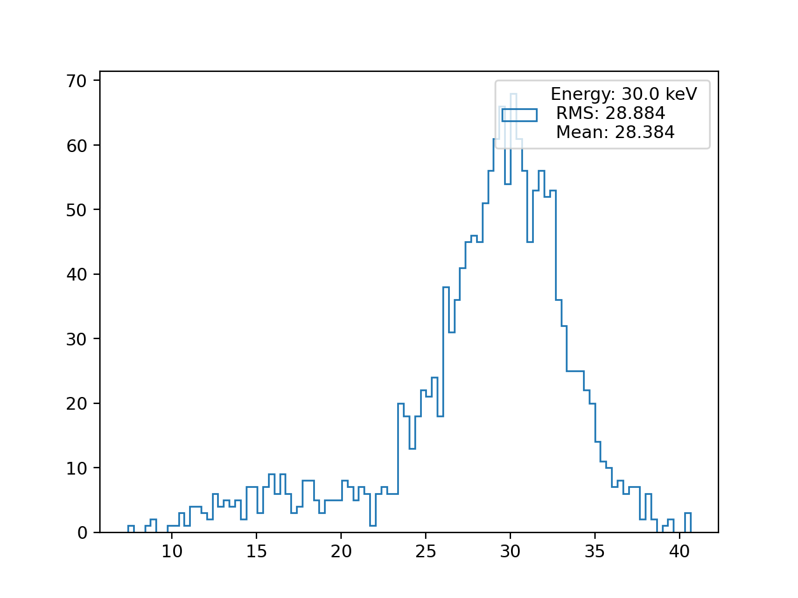

# MLHEP-2021 Baseline + some tweaks
## Important information
To train the model again run

```
python train.py
```

The best 3 models will be stored in `checkpoint_model/best_model_53/`.
The model that generates my best submission is stored in `checkpoints_model/best_model_52/best_model-epoch=18-val_loss=8.42.ckpt`, which is the filepath given to both report.py and generate_submission.py. Hence, to obtain my submission's report and .csv run:

```
python report.py && python generate_submission.py
```

## Dataset
Dataset is on CoCalc in folder `/home/user/share/competition` and is available at [Kaggle](https://www.kaggle.com/c/mlhep2021-classification/data)

The train and test folders contain images in `.png` format. The train filenames contain the energy and the folder names the particle class.

```
train
├── ER
└── NR
```
The most important part is the particle energy which is in {1.0, 3.0, 6.0, 10.0, 20.0, 30.0} and has `_keV` suffix.

```
0.00012752991074573__CYGNO_60_40_ER_30_keV_930V_30cm_IDAO_iso_crop_hist_pic_run4_ev846;1.png
0.0001805024851534__CYGNO_60_40_ER_10_keV_930V_30cm_IDAO_iso_crop_hist_pic_run2_ev317;1.png
0.00013557143164375__CYGNO_60_40_ER_10_keV_930V_30cm_IDAO_iso_crop_hist_pic_run2_ev842;1.png
0.00019057084775703__CYGNO_60_40_ER_3_keV_930V_30cm_IDAO_iso_crop_hist_pic_run2_ev116;1.png
0.0001135022106767__CYGNO_60_40_ER_10_keV_930V_30cm_IDAO_iso_crop_hist_pic_run5_ev136;1.png
0.0001275016178883__CYGNO_60_40_ER_3_keV_930V_30cm_IDAO_iso_crop_hist_pic_run2_ev485;1.png
0.0001375808674508__CYGNO_60_40_ER_30_keV_930V_30cm_IDAO_iso_crop_hist_pic_run3_ev662;1.png
0.0011665058173393__CYGNO_60_40_ER_10_keV_930V_30cm_IDAO_iso_crop_hist_pic_run5_ev574;1.png
0.0011465791675372__CYGNO_60_40_ER_3_keV_930V_30cm_IDAO_iso_crop_hist_pic_run2_ev114;1.png
0.0011065850424555__CYGNO_60_40_ER_3_keV_930V_30cm_IDAO_iso_crop_hist_pic_run4_ev868;1.png
```
#### Data spliting
The total number of samples in the dataset is ~30k sample distributed with 2 classes ER=0 and NR=1.
The dataset are interleaved in the following scheme:
##### Interleave the files
|Energy| He   | e |
| ---  | ---- |---|
| 1    |  *   | - |
| 3    |  -   | * |
| 6    |  *   | - |
| 10   |  -   | * |
| 20   |  *   | - |
| 30   |  -   | * |
* is training; - is testing

## Results 
To generate the report just run:
```
python report.py
```
This will generate `./resultsreport.log` in the current directory containg information and bunch of plots in the `./results/` directory

---
### Regression









# Submission
To generate `submission_classification.csv.gz` and `submission_regression.csv.gz` run:
```
python generate_submission.py
```
By default, it will use the checkpoints provided in the repository, if you trained your own model,
you should put the appropriate checkpoints into `config.ini`.

